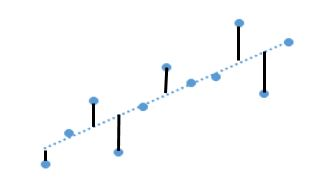
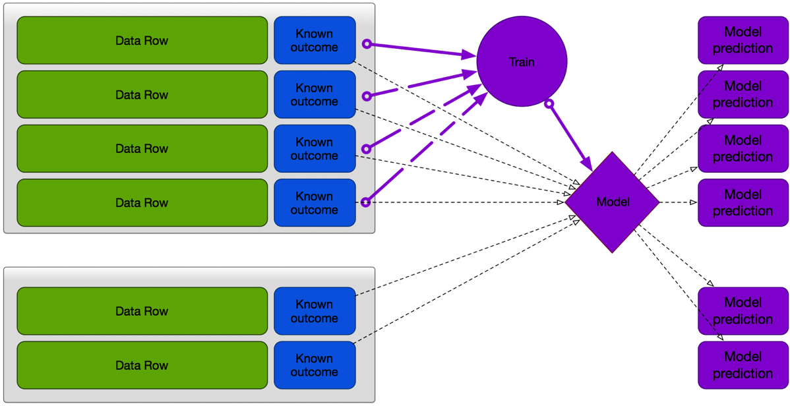
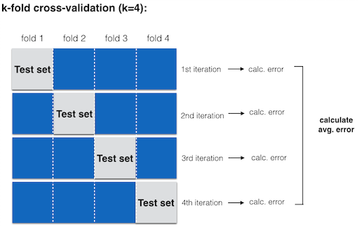
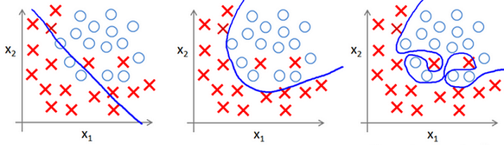

## 好的機器學習模型

一個好的機器學習模型大致上具有這幾個特性:

* 準確度高
* 計算時間短
* 容易解釋

## 基本機器學習模型的對應衡量指標

|機器學習模型|衡量表現指標|
|------------|------------|
|分類(Classification)|混淆矩陣Confusion Matrix|
|迴歸(Regression)|均方根誤差RMSE(Root Mean Squared Error)|
|分群(Clustering)|唐恩指數Dunn's Index|

## 混淆矩陣Confusion Matrix

* 以二元分類器為例:


$$Accuracy = \frac{TP + TN}{TP + FP + FN + TN}$$

$$Precision = \frac{TP}{TP + FP}$$

$$Recall = \frac{TP}{TP + FN}$$

## 混淆矩陣Confusion Matrix - Hands On

* [資料集](https://www.kaggle.com/c/titanic/data)

```{r}
# 載入需要的套件
library(magrittr)
library(rpart)

# 讀取資料
titanic <- read.csv("/Users/tkuo/ntu_train/NTUTrainRL3/data/train.csv", header = TRUE)
titanic <- titanic[, c(2, 3, 5, 6)] %>% na.omit
titanic$Survived <- factor(titanic$Survived, levels = c(1, 0))
str(titanic)

# 建立一個決策樹模型
set.seed(1)
treeModel <- rpart(Survived ~ ., data = titanic, method = "class")
titanicToBePredicted <- titanic[, -1]
prediction <- predict(treeModel, newdata = titanicToBePredicted, type = "class")

# 將混淆矩陣印出來
confusionMatrix <- table(titanic$Survived, prediction, dnn = c("Actual", "Predicted"))
confusionMatrix

# 獲得TP, TN, FP, FN
TP <- confusionMatrix[1, 1]
TN <- confusionMatrix[2, 2]
FP <- confusionMatrix[2, 1]
FN <- confusionMatrix[1, 2]

# 計算Accuracy, Precision, Recall
accuracy <- (TP + TN)/(TP + TN + FP + FN)
precision <- TP/(TP + FP)
recall <- TP/(TP + FN)

# 印出Accuracy, Precision, Recall
accuracy
precision
recall
```

## 混淆矩陣Confusion Matrix - Do It Yourself

* 這次換你囉, 加入`Fare`, `Cabin`, 與`Embarked`這三個變數試試看!

## 均方根誤差RMSE

* 資料點與預測迴歸線的平均距離

$$RMSE = \sqrt{\frac{1}{N}\sum_{i=1}^N (y_i - \hat y_i)^2}$$



## 均方根誤差RMSE - Hands on

```{r}
# 氣溫與冰紅茶銷量
temperature <- c(29, 28, 34, 31, 25, 29, 32, 31, 24, 33, 25, 31, 26, 30)
icedTeaSales <- c(77, 62, 93, 84, 59, 64, 80, 75, 58, 91, 51, 73, 65, 84)
icedTeaData <- data.frame(temperature, icedTeaSales)

# 建立一個線性迴歸模型
lmFit <- lm(formula = icedTeaSales ~ temperature, data = icedTeaData)
icedTeaDataToBePredicted <- data.frame(icedTeaData[, -2])
prediction <- predict(lmFit, newdata = icedTeaDataToBePredicted)
RMSE <- sqrt(sum( (icedTeaData$icedTeaSales - prediction) ^ 2) / nrow(icedTeaData))
RMSE
```

## 均方根誤差RMSE - Do It Yourself(1)

* 來這裡下載資料集[airUCI](https://archive.ics.uci.edu/ml/datasets/Airfoil+Self-Noise#)
* 只使用`freq`, `angle`, 以及`chLength`這三個變數來預測`dec`
* 計算RMSE1

```{r}
airUCI <- read.csv("/Users/tkuo/ntu_train/NTUTrainRL3/data/airUCI.csv", header = FALSE, col.names = c("freq", "angle", "chLength", "velocity", "thickness", "dec"))
```

## 均方根誤差RMSE - Do It Yourself(2)

* 再加入`velocity`以及`chLength`這兩個變數, 共5個變數來預測`dec`
* 計算RMSE2
* 比較RMSE1與RMSE2

## 唐恩指數Dunn's Index

* 同一個群集中的**相似度**要高
* 不同群集之間的**相似度**要低
* 所以我們使用**唐恩指數**來判別分群模型的表現

$$Dunn's\,Index = \frac {最小的群集間距離}{最大的群集直徑}$$

## 唐恩指數Dunn's Index - Hands on

```{r}
# 看看鳶尾花資料集的結構
str(iris)

# 建立一個分群模型
irisCluster <- iris[-5]
kmeansIris<-kmeans(irisCluster, centers = 3)

# 作圖
plot(formula = Petal.Length ~ Petal.Width, data = irisCluster, col = kmeansIris$cluster, main = "將鳶尾花做分群", xlab = "花瓣寬度", ylab = "花瓣長度", family = "STHeiti")

# 計算WSS與BSS的比例
WSS <- kmeansIris$tot.withinss
BSS <- kmeansIris$betweenss
ratio <- WSS/BSS
ratio
```

## 唐恩指數Dunn's Index - Do It Yourself

* 來這裡下載資料集[seedsUCI](https://archive.ics.uci.edu/ml/datasets/seeds)
* 仿照前例, 計算WSS/BSS

```{r}
seedsUCI <- read.csv("/Users/tkuo/ntu_train/NTUTrainRL3/data/seedsUCI.csv", header = FALSE, col.names = c("area", "perimeter", "compactness", "length", "width", "asymmetry", "grooveLength", "type"))
seedsUCIToBeClustered <- seedsUCI[, -8]
```

## 關於機器學習, 資料探勘與統計

* 機器學習對於**未知資料**的預測較為在意
* 資料探勘對於**現有資料**的樣態或找出有趣因子更為在意
* 統計對於模型與資料的配適度更為在意
* 資料探勘跟機器學習其實相輔相成，實務上你很難區隔
* 統計是實現機器學習的方法之一

## 訓練與測試

* 實務上我們要將資料分為**訓練(training)**與**測試(test)**
* 這兩組資料不重疊
* 建議比例為70%與30%
* 在監督式學習(分類與迴歸)使用，因為非監督式學習(分群)資料並沒有答案

## 怎麼切分你的訓練與測試

* 如果是做分類，類型的分佈在訓練與測試資料中的分佈應該要相似
* 不要遺漏任何一種類別
* 把資料做洗牌以後再做切分



## 怎麼切分你的訓練與測試 - Hands on

* 洗牌我們可以善用`sample()`函數，查詢一下`sample()`函數吧！

```{r}
titanic <- read.csv("/Users/tkuo/ntu_train/NTUTrainRL3/data/train.csv", header = TRUE)
titanic <- titanic %>% na.omit

# 洗牌
n <- nrow(titanic)
set.seed(123)
shuffledTitanic <- titanic[sample(n), ]

# 看看洗牌前與洗牌後的titanic
head(titanic)
head(shuffledTitanic)

# 依照70%:30%的比例切分training與test
trainingIndices <- 1:round(0.7 * n)
training <- shuffledTitanic[trainingIndices, ]
testIndices <- (round(0.7 * n) + 1):n
test <- shuffledTitanic[testIndices, ]

# 印出training與test的結構
str(training)
str(test)
```

## 怎麼切分你的訓練與測試 - Do It Yourself

* 我希望training約有536個觀測值, test約有178個觀測值

## 更細膩精準地切分你的訓練與測試

* 在前面的例子我們只使用一次`sample()`函數
* 更細膩的方法稱為**交叉驗證(cross validation)**
* 最後以平均的指標(可能是accuracy, precision或recall...etc.)作為結果



## 更細膩精準地切分你的訓練與測試 - Hands on

* 用`Pclass`, `Sex`, 與`Age`作為預測變數就好
* k-fold cross validation, k = 4

```{r}
titanic <- read.csv("/Users/tkuo/ntu_train/NTUTrainRL3/data/train.csv", header = TRUE)
titanic <- titanic[, c("Survived", "Pclass", "Sex", "Age")]
titanic <- titanic %>% na.omit
titanic$Survived <- as.factor(titanic$Survived)
titanic$Pclass <- as.factor(titanic$Pclass)

# 洗牌
n <- nrow(titanic)
set.seed(123)
shuffledTitanic <- titanic[sample(n), ]

# 設定亂數種子
set.seed(123)

# accuracies向量
accuracies <- c()

for (i in 1:4) {
  # test的列數
  indices <- (((i-1) * round((1/4)*nrow(shuffledTitanic))) + 1):((i*round((1/4) * nrow(shuffledTitanic))))
  training <- shuffledTitanic[-indices,]
  test <- shuffledTitanic[indices,]
  
  # 建立決策樹模型
  tree <- rpart(Survived ~ ., training, method = "class")
  
  # 預測
  prediction <- predict(tree, test, type="class")
  
  # 建立混淆矩陣
  confusionMatrix <- table(test$Survived, prediction)
  
  # 把每次的accuracy放回accuracies向量
  accuracies[i] <- sum(diag(confusionMatrix))/(sum(confusionMatrix))
}
# 平均這4個accuracy
mean(accuracies)
```

## 更細膩精準地切分你的訓練與測試 - Do It Yourself

* k-fold cross validation, k = 8

## Underfitting vs. Overfitting?

* 你是否常常聽到人家說underfitting或overfitting?




* 在**適用性**與**精確性**之間取得良好的平衡

## Underfitting vs. Overfitting? - Hands on

* 我們的分類器overfitting(對訓練資料集的分類完全正確, accuracy = 100%)
* 但是對測試資料集的分類accuracy僅有62.5%

```{r}
# 倒帳資料集
debtIncomeRatio <- c(1, 2.112, 4.123, 1.863, 2.973, 1.687, 5.891, 3.167, 1.23, 2.441, 3.555, 3.25, 1.333)
default <- c(0, 0, 1, 0, 1, 0, 1, 0, 0, 1, 0, 0, 1)
defaultDataTrain <- data.frame(debtIncomeRatio, default)
defaultDataTrain$default <- as.factor(defaultData$default)

# 分類器
default_classifier <- function(x){
  prediction <- rep(NA, length(x))
  prediction[x > 4] <- 1
  prediction[x >= 3 & x <= 4] <- 0
  prediction[x >= 2.2 & x < 3] <- 1
  prediction[x >= 1.4 & x < 2.2] <- 0
  prediction[x > 1.25 & x < 1.4] <- 1
  prediction[x <= 1.25] <- 0
  return(prediction)
}

# training資料集的accuracy
defaultPredictionOverTrain <- default_classifier(defaultDataTrain$debtIncomeRatio)
confusionMatrixOverTrain <- table(defaultDataTrain$default, defaultPredictionOverTrain)
accuracyOverTrain <- sum(diag(confusionMatrixOverTrain)) / sum(confusionMatrixOverTrain)
accuracyOverTrain

# test資料集
debtIncomeRatio <- c(1.5, 	4.941, 	3.429, 	3.493, 	3.38, 	3.689, 	1, 	6.761, 	2.195, 	2.857, 	1.883, 	1.744, 	2.325, 	1.25, 	1.8, 	2.5, 	4.617, 	2.206, 	8.323, 	3.764, 	1.932, 	3.153, 	1.983, 	3.812, 	4.295, 	4.5, 	1.3, 	1, 	5.009, 	5.888, 	1, 	3.456, 	3.379, 	1.755, 	2.333, 	2.188, 	1.406, 	1.857, 	3.707, 	3.766, 	2.93, 	2.076, 	1.9, 	1.684, 	2.769, 	4.571, 	3.029, 	3.628)
default <- c(0, 	1, 	1, 	1, 	0, 	1, 	0, 	1, 	1, 	0, 	0, 	0, 	0, 	0, 	1, 	0, 	1, 	0, 	1, 	0, 	0, 	0, 	0, 	1, 	0, 	1, 	0, 	0, 	1, 	0, 	0, 	1, 	0, 	0, 	0, 	0, 	0, 	0, 	1, 	0, 	1, 	0, 	0, 	1, 	1, 	0, 	0, 	0)
defaultDataTest <- data.frame(debtIncomeRatio, default)
defaultDataTest$default <- as.factor(defaultDataTest$default)

# test資料集的accuracy
defaultPredictionOverTest <- default_classifier(defaultDataTest$debtIncomeRatio)
confusionMatrixOverTest <- table(defaultDataTest$default, defaultPredictionOverTest)
accuracyOverTest <- sum(diag(confusionMatrixOverTest)) / sum(confusionMatrixOverTest)
accuracyOverTest
```

## Underfitting vs. Overfitting? - Do It Yourself

* 用新的分類器對訓練資料分類並計算accuracy
* 用新的分類器對測試資料分類並計算accuracy
* 跟前面的例子比較一下

```{r}
# 分類器
default_classifier <- function(x){
  prediction <- rep(NA, length(x))
  prediction[x > 4] <- 1
  prediction[x <= 4] <- 0
  return(prediction)
}
```