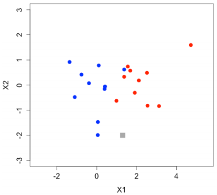
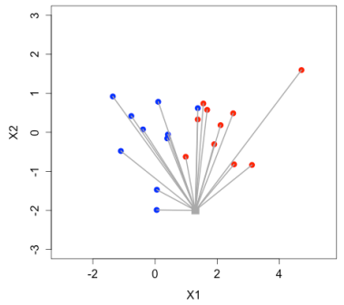

## 摘要

* 決策樹
* k最近鄰分類法(k-Nearest Neighbors)
* ROC曲線

## 分類的特性

* 自動依據已知資料為未知資料做預測分類
* 一個人整體平均而言是開心還是不開心?
    * 數值型變數
        * 身高
        * 體重
        * 年收入
        * 年紀
        * ...
    * 類別型變數
        * 感情狀態
        * 出生地
        * 有無運動習慣
        * 有無房
        * 有無車
        * ...

## 決策樹的外型與名稱

* 節點(Nodes)
    * 根(Root)
    * 葉(Leafs)
* 枝(Edges)

* 以Titanic資料集的決策樹為例:


## 一個決策樹是怎麼產生的

* 決策樹終極的目標其實是希望每一**葉**(Leaf)都只有一種分類
* 但是在實務上幾乎是不可能的
* 在每一個節點上面有兩件事情要決定:
    * 選一個變數來切分資料
    * 決定變數的切分門檻
* 常用的決定指標叫做**資訊獲利(Information Gain)**
    * 如果資料集切分得好, 資訊獲利值高
    * 資料集切分得不好, 資訊獲利值低
    * 在每個節點上, 都要選擇最高資訊獲利值的變數與切分門檻
* 而 `rpart()` 預設是用另一個常用的指標叫做**吉尼不純度(Gini Impurity)**
    * 如果資料集切分得好, 吉尼不純度低
    * 資料集切分得不好, 吉尼不純度高
    * 在每個節點上, 都要選擇最低吉尼不純度的變數與切分門檻

## 一個決策樹是怎麼產生的 - Hands on

* 每個節點中都有三行資訊
    * 第一個數字告訴你這個節點資料中最多的類別是什麼
    * 第二組數字告訴你類別的比例
    * 第三個數字告訴你這個節點佔所有訓練資料的比例

```{r}
library(rpart)
library(rattle)
library(rpart.plot)
library(RColorBrewer)
library(magrittr)

# 載入titanic資料集
titanic <- read.csv("/Users/tkuo/ntu_train/NTUTrainRL3/data/train.csv", header = TRUE)
titanic <- titanic[, c(2, 3, 5, 6)] %>% na.omit
titanic$Survived <- factor(titanic$Survived, levels = c("1", "0"))
titanic$Pclass <- factor(titanic$Pclass)

# 建立訓練與測試樣本
n <- nrow(titanic)
set.seed(123)
shuffledTitanic <- titanic[sample(n), ]
trainIndices <- 1:round(0.7 * n)
train <- shuffledTitanic[trainIndices, ]
testIndices <- (round(0.7 * n) + 1):n
test <- shuffledTitanic[testIndices, ]

# 建立決策樹模型
tree <- rpart(Survived ~ ., data = train, method = "class")

# 畫決策樹
fancyRpartPlot(tree)

# 預測測試樣本
prediction <- predict(tree, test, type = "class")

# 計算accuracy
confusionMatrix <- table(test$Survived, prediction)
accuracy <- sum(diag(confusionMatrix)) / sum(confusionMatrix)
accuracy
```

## 一個決策樹是怎麼產生的 - Do It Yourself

* 加入`SibSp`, `Fare`, `Cabin`與`Embarked`再玩一次!

## 修剪(pruning)是什麼?

* 你還記得我們上一個章節教的Overfitting嗎?
* 修剪就是為了要避免Overfitting的情況產生!

## 修剪(pruning)是什麼? - Hands on

* `rpart()`有一個參數是`control = rpart.control`, 輸入 `?rpart.control`
* `rpart.control(cp = )` 是complexity parameter, 如果 `cp` 值愈小, accuracy就會愈高, 但也愈可能Overfitting
* `prune()`函數可以針對Overfitting的決策樹模型修改 `cp`

```{r}
# 建立一個Overfitting的決策樹模型(cp = 0.00001)
set.seed(123)
treeComplex <- rpart(Survived ~ ., train, method = "class", control = rpart.control(cp = 0.00001))

# 作圖
fancyRpartPlot(treeComplex)

# 修剪
treePruned <- prune(treeComplex, cp=0.01)

# 作圖
fancyRpartPlot(treePruned)
```

## 修剪(pruning)是什麼? - Do It Yourself

* 把前一個加入加入`SibSp`, `Fare`, `Cabin`與`Embarked`的決策樹模型 `cp` 指定為 0.00001, 並使用`prune()`函數進行修剪為預設的cp = 0.01

## 改用資訊獲利(Information Gain)試試看 - Hands on

* 前面我們使用預設的**吉尼不純度(Gini Impurity)**作為切分資料集的決定指標
* 若想改為使用**資訊獲利(Information Gain)**在建立模型的時候要多指定一個參數 `parms = list(split = "information")`
* 輸入 `?rpart` 看看 `parms` 的參數說明

```{r}
# 建立
set.seed(123)
treeIG <- rpart(Survived ~ ., train, method = "class", parms = list(split = "information"))
predictionIG <- predict(treeIG, test, type = "class")
confusionMatIG <- table(test$Survived, predictionIG)
accuracyIG <- sum(diag(confusionMatIG)) / sum(confusionMatIG)
accuracyIG
```

## k最近鄰分類法(k-Nearest Neighbors)

* 用一個二元分類的圖例說明
* k = 1





* 如果 k = 5 就會從最近的 5 個點中哪個顏色較多決定新的資料點屬於什麼顏色，所以 k-nn 的 k 應該是一個奇數

* 計算距離的方式常見有兩種:
    * 歐幾里得距離(Eucledian Distiance)
    * 曼哈頓距離(Manhattan Distance)

$$d_E(a, b) = \sqrt {\sum_{i=1} ^ D (a_i - b_i) ^ 2}$$

$$d_M(a, b) = \sum_{i = 1} ^ D \vert{a_i - b_i}\vert$$

## 單位標準化

* 既然這個演算法使用距離作分類, 我們必須對這些變數的單位進行**標準化**

|height(m)|weight(kg)|
|---------|----------|
|1.92     |92        |
|1.92     |91        |
|2.03     |92        |

|height(cm)|weight(kg)|
|----------|----------|
|192       |92        |
|192       |91        |
|203       |92        |

* 標準化公式

    * Min Max Method

$$\frac{x - min(x)}{max(x) - min(x)}$$

## 單位標準化 - Hands on

* 將 `titanic` 資料集的 Pclass 標準化

```{r}
titanic <- read.csv("/Users/tkuo/ntu_train/NTUTrainRL3/data/train.csv", header = TRUE)
titanic <- titanic[, c(2, 3, 6)] %>% na.omit
titanic$Survived <- factor(titanic$Survived, levels = c("1", "0"))

# 標準化Pclass
minPclass <- min(titanic$Pclass)
maxPclass <- max(titanic$Pclass)
titanic$Pclass <- (titanic$Pclass - minPclass) / (maxPclass - minPclass)
```

## 單位標準化 - Do It Yourself

* 將`titanic` 資料集的 Age 也進行標準化

## k最近鄰分類法(k-Nearest Neighbors) - Hands on

* `knn()` 函數在 `class` 套件中, 使用前要安裝與載入
* 使用 `install.packages()` 與 `library()` 進行安裝和載入
* `knn()` 函數我們主要使用 4 個參數:
    * `train`
    * `test`
    * `cl`
    * `k`

```{r}
# 切分訓練測試樣本
set.seed(123)
n <- nrow(titanic)
shuffledTitanic <- titanic[sample(n), ]
trainIndices <- 1:round(0.7 * n)
train <- shuffledTitanic[trainIndices, ]
testIndices <- (round(0.7 * n) + 1):n
test <- shuffledTitanic[testIndices, ]

# 先將標準答案獨立出來
trainLabels <- train$Survived
testLabels <- test$Survived

# 獨立預測變數
knnTrain <- train[, -c(1)]
knnTest <- test[, -c(1)]

# 建立模型
library(class)
set.seed(123)
pred <- knn(train=knnTrain, test=knnTest, cl=trainLabels, k=5)
```

## k最近鄰分類法(k-Nearest Neighbors) - Do It Yourself

* 建立混淆矩陣並將accuracy計算印出。

## 如何選擇 k 值? - Hands on

* 我們無法用直覺來選擇 k = ?, 不如就用程式幫我們決定吧!

```{r}
range <- 1:round(0.2 * nrow(knnTrain))
accuracies <- rep(NA, length(range))
set.seed(123)

for (i in range) {
  prediction <- knn(train = knnTrain, test = knnTest, cl = trainLabels, k = i)
  confusionMatrix <- table(testLabels, prediction)
  accuracies[i] <- sum(diag(confusionMatrix))/sum(confusionMatrix)
}

plot(range, accuracies, xlab="k")
which.max(accuracies)
```

## 在k最近鄰分類法中納入類別型變數

* 要使用**虛擬變數(dummy variable)**來對我們的類別型變數重新編碼
* 如果是二元的類別型變數:

|性別|男性|女性|
|----|----|----|
|男  |1   |0   |
|女  |0   |1   |
|... |... |... |

* 如果是三元的類別型變數:

|母語|閩南語|國語|客家語|
|----|------|----|------|
|閩南語|1   |0   |0     |
|國語|0     |1   |0     |
|客家語|0   |0   |1     |
|.. .|...   |... |...   |

* 以此類推...

## 二元分類模型的表現指標 - AUC

* 除了常用的 `accuracy` 來衡量１二元分類模型的表現之外, 我們還有一個指標叫做 `AUC(Area Under Curve)`
* `AUC` 的 Curve 指的是ROC曲線, **R**eiceiver **O**perator **C**haracteristic Curve
* 建立ROC曲線時我們仍舊仰賴我們熟悉的**混淆矩陣**
* x軸: False Positive Rate

$$FPR = \frac{FP}{FP + TN}$$

* y軸: True Positive Rate

$$TPR = \frac{TP}{TP + FN}$$


* `AUC` 就是計算 ROC 曲線底下的面積, 這個數字愈接近1, 就表示分類分得愈好; 愈接近0.5就表示分類分得不好

* 傑出: `AUC` = 0.9 - 1.0
* 優秀: `AUC` = 0.8 - 0.9
* 普通: `AUC` = 0.7 - 0.8
* 不好: `AUC` = 0.6 - 0.7
* 差勁: `AUC` = 0.5 - 0.6

## AUC - Hands on

* 先前我們在使用 `predict()` 函數的時候是直接預測分類類別, 現在我們要改為 `class = "prob"`, 意即模型預測的 `存活機率`
* 我們要使用 `ROCR` 這個套件協助我們作圖

```{r}
# 建立訓練與測試樣本
set.seed(123)
n <- nrow(titanic)
shuffledTitanic <- titanic[sample(n), ]
trainIndices <- 1:round(0.7 * n)
train <- shuffledTitanic[trainIndices, ]
testIndices <- (round(0.7 * n) + 1):n
test <- shuffledTitanic[testIndices, ]

# ROC Curve
set.seed(123)
tree <- rpart(Survived ~ ., train, method = "class")
probabilities <- predict(tree, test, type = "prob")[,1]
library(ROCR)
pred <- prediction(probabilities, labels = test$Survived)
perf <- performance(pred, "tpr", "fpr")
# 執行正常但是不能knit
# plot(perf)

# AUC
perf <- performance(pred, "auc")
perf@y.values[[1]]
```

## 用AUC比較模型 - Hands on

```{r}
# 載入titanic資料集
titanic <- read.csv("/Users/tkuo/ntu_train/NTUTrainRL3/data/train.csv", header = TRUE)
titanic <- titanic[, -c(1, 4, 9)] %>% na.omit
titanic$Survived <- factor(titanic$Survived, levels = c("1", "0"))
titanic$Pclass <- factor(titanic$Pclass)

# 建立訓練與測試樣本
n <- nrow(titanic)
set.seed(123)
shuffledTitanic <- titanic[sample(n), ]
trainIndices <- 1:round(0.7 * n)
trainComp <- shuffledTitanic[trainIndices, ]
testIndices <- (round(0.7 * n) + 1):n
testComp <- shuffledTitanic[testIndices, ]

# ROC Curve
set.seed(123)
treeComp <- rpart(Survived ~ ., trainComp, method = "class")
probabilitiesComp <- predict(treeComp, testComp, type = "prob")[,1]
predComp <- prediction(probabilitiesComp, labels = testComp$Survived)
perfComp <- performance(predComp, "tpr", "fpr")
# 執行正常但是不能knit
# plot(perf, main = "ROC Curves", col = "blue", lwd = 2)
# plot(perfComp, add = TRUE, col = "green", lwd = 2)
```