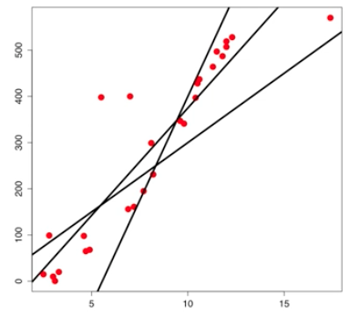

## 摘要

* 單變數
* 多變數
* GLM & GAM

## 從氣溫與冰紅茶銷量開始

* 平均氣溫與手搖飲料店冰紅茶銷量的關係為何?
* 通常會先畫一個 `scatterplot` 散佈圖來看關係

```{r}
temperature <- c(29, 28, 34, 31, 25, 29, 32, 31, 24, 33, 25, 31, 26, 30)
icedTeaSales <- c(77, 62, 93, 84, 59, 64, 80, 75, 58, 91, 51, 73, 65, 84)
plot(x = temperature, y = icedTeaSales, col = "red", pch = 16)
```

* 這個關係看起來可以用一條直線來描述
* 我們會從很多條線中選一條最**fit**的線出來



## 什麼是最fit的線?

* 最**fit**的線長這個樣子

$$Y = \beta_o + \beta_1X + \epsilon$$

* 計算每一點跟這條線的差距: $res_i$

$$res_i = y_i - (\beta_0 + \beta_1x_i)$$

* 最小化$res_i$的平方和

$$Min. SS_{res} = \sum_{i = 1}^N(res_i) ^ 2$$

## 什麼是最fit的線 - Hands on

* 使用 `lm()` 函數來為你做好這些事情
* 在 R Console 輸入 `?lm` 來看看這個函數

```{r}
icedTeaData <- data.frame(temperature = temperature, icedTeaSales = icedTeaSales)
lmIcedTea <- lm(formula = icedTeaSales ~ temperature, data = icedTeaData)
lmIcedTea$coefficients
toBePredicted <- data.frame(temperature = 30)
predicted <- predict(lmIcedTea, newdata = toBePredicted)
predicted
```

## 什麼是最fit的線 - Do It Yourself

* 使用內建資料集 `cars`
* 畫出散佈圖, X軸為速度, Y軸為煞車距離
* 預測速度26, 煞車距離為何

## 如何判斷迴歸模型的表現?

* RMSE(愈低愈好)

$$RMSE = \sqrt{\frac{1}{N}\sum_{i=1}^N(y_i - \hat{y}_i) ^ 2}$$

* R-squared(愈接近1愈好)

$$SS_res = \sum_{i=1}^N(y_i - \hat{y}_i) ^ 2$$
$$SS_tot = \sum_{i=1}^N(y_i - \bar{y}) ^ 2$$
$$R^2 = 1 - \frac{SS_{res}}{SS_{tot}}$$

## 如何判斷迴歸模型的表現 - Hands on

```{r}
icedTeaSalesEst <- predict(lmIcedTea, newdata = data.frame(icedTeaData[, 1]))

# 計算RMSE
res <- icedTeaData$icedTeaSales - icedTeaSalesEst
rmse <- sqrt( sum(res^2) /nrow(icedTeaData) )
rmse

# 計算R-squared
ss_res <- sum (res ^ 2)
ss_tot <- sum( (icedTeaData$icedTeaSales - mean(icedTeaData$icedTeaSales))^2 )
r_sq <- 1 - ss_res / ss_tot
r_sq

# 跟 summary() 的結果比較
summary(lmIcedTea)$r.squared
```

## 如何判斷迴歸模型的表現 - Do It Yourself

* 使用內建資料集 `cars`
* 計算rmse
* 計算R-squared
* 跟 `summary()` 的結果比較

## 加入更多的變數

* 除了氣溫會影響冰紅茶的銷售量, 你覺得還有其他因素會影響冰紅茶銷量
* 像是奶茶的銷量, 當天鄰近友商是否有促銷活動...等
* 加入更多變數可以提高模型預測的精準度
* 最**fit**的面變為

$$Y = \beta_o + \beta_1X_1 + \beta_2X_2 + \epsilon$$

* 計算每一點跟這條面的差距: $res_i$

$$res_i = y_i - (\beta_0 + \beta_1x_{i1} + \beta_2x_{i2})$$

* 最小化$res_i$的平方和

$$Min. SS_{res} = \sum_{i = 1}^N(res_i) ^ 2$$

## 加入更多的變數 - Hands on

* 很可惜我們沒有奶茶的銷量...
* 我們改用 `chocolate.csv` 資料集練習

```{r}
chocolate <- read.csv("/Users/tkuo/ntu_train/NTUTrainRL3/data/chocolate.csv")
par(mfrow=c(1, 2))
plot(calories ~ protein, chocolate)
plot(calories ~ fat, chocolate)

# 單變數
chocoSingleVar <- lm(formula = calories ~ protein, data = chocolate)
summary(chocoSingleVar)$r.squared

# 雙變數
chocoTwoVars <- lm(formula = calories ~ protein + fat, data = chocolate)
summary(chocoTwoVars)$adj.r.squared
```

* 多納入脂肪含量使模型的R平方增加到接近0.9

## 加入更多的變數 - Do It Yourself

* 將熱量對大小 `size` 作圖
* 將 `size` 也納入

## 單變數/多變數線性模型需要符合的假設

* y變數是常態分佈，且來自隨機取樣
* x變數是固定的常數或實驗數據，且其量測是沒有誤差
* x變數彼此之間是獨立事件
* 誤差值是常態分佈

```{r}
chocoLm <- lm(formula = calories ~ ., data = chocolate)
par(mfrow=c(1, 2))
plot(x = chocoLm$fitted.values, y = chocoLm$residuals)
qqnorm(chocoLm$residuals)
```

* 實務上用這兩張圖形來檢驗, 左圖中的點要呈現隨機分佈, 右圖中的點要排在線上
* 當然還有其他的進階檢驗方法

## GLM - 羅吉斯迴歸

* 當目標變數 Y 介於 0 與 1 之間的時候使用, 例如預測機率
* 也可用於二元分類器

$$P(y = 1 \vert x_1,...,x_m) = \frac{1}{1+ e ^ {-(\beta_0 + \beta_1x_1 + ... + \beta_mx_m)}}$$

* 使用 `glm()` 函數，指定 `family = "binomial"`

```{r}
library(magrittr)
titanic <- read.csv("/Users/tkuo/ntu_train/NTUTrainRL3/data/train.csv", header = TRUE)
titanic <- titanic[, c(2, 3, 5, 6)] %>% na.omit
titanic$Survived <- factor(titanic$Survived, levels = c("1", "0"))
titanic$Pclass <- factor(titanic$Pclass)

# 建立訓練與測試樣本
n <- nrow(titanic)
set.seed(123)
shuffledTitanic <- titanic[sample(n), ]
trainIndices <- 1:round(0.7 * n)
train <- shuffledTitanic[trainIndices, ]
testIndices <- (round(0.7 * n) + 1):n
test <- shuffledTitanic[testIndices, ]

# 建立羅吉斯迴歸模型
titanic_logistic <- glm(formula = Survived ~ ., family = "binomial", data = train)
prediction <- predict(titanic_logistic, newdata = test, type = "response")
prediction_cutoff_50 <- ifelse(prediction > 0.5, 1, 0)
confusionMatrix <- table(test$Survived, prediction_cutoff_50, dnn = c("actural", "predict"))
accuracy <- sum(diag(confusionMatrix))/sum(confusionMatrix)
accuracy
```

## X與Y不是單調的關係

* 使用資料集 `urbanPopGdp.csv`
* 使用 `str()` 函數看看這個資料集
* 我們試圖要用國內生產毛額 `gdp` 來預測城市居住人口比例 `urban_pop`

```{r}
worldBankDat <- read.csv("/Users/tkuo/ntu_train/NTUTrainRL3/data/urbanPopGdp.csv", header = TRUE)
plot(x = worldBankDat$gdp, y = worldBankDat$urb_pop)
lmNonTransformed <- lm(formula = urb_pop ~ gdp, data = worldBankDat)
summary(lmNonTransformed)$r.squared
```

* R平方很低呀, 該如何是好?

## X與Y不是線性關係 - Hands on

```{r}
# 做個log轉換吧
plot(worldBankDat$urb_pop, log(worldBankDat$gdp))
lmLogTransformed <- lm(formula = urb_pop ~ log(gdp), data = worldBankDat)
summary(lmLogTransformed)$r.squared
```

## 進階的GAM

* 我怎麼知道什麼時候要用對數轉換? 什麼時候要用倒數?
* 讓GAM(Generalized Additive Model)來做這件事
* `gam()` 函數在 `mgcv` 這個套件中

```{r}
library(mgcv)
fit_gam <- gam(formula = urb_pop ~ s(gdp), data = worldBankDat)
summary(fit_gam)
par(mfrow=c(1, 1))
plot(x = worldBankDat$gdp, y = worldBankDat$urb_pop)
x <- seq(0, 100000, length = 100)
y <- predict(fit_gam, data.frame(gdp = x))
lines(x, y, col = "red", lwd = 2)
```