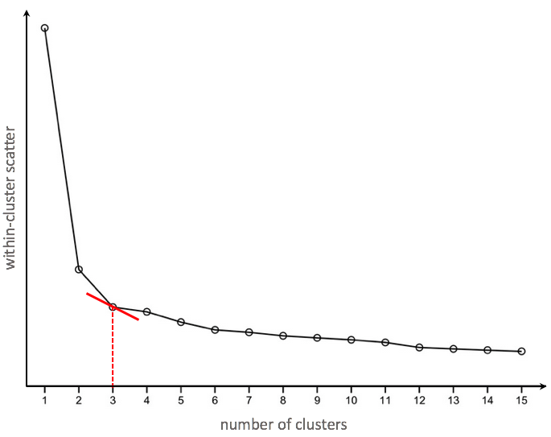

## 摘要

* k-means分群
* 衡量表現與正規化
* 階層式分群

## 分群(Clustering)

* 非監督式學習
* 訓練資料集是沒有答案的, 所以沒有對與錯
* 組內差異小
* 組間差異大
* 差異是以觀測值之間的**距離**作為度量
    * 歐幾里德距離, 曼哈頓距離, ...
* 應用 e.g.
    * STP行銷的S(客戶分群)
    * 極端值探勘
    * 預處理(pre-processing)資料
    * ...

## 組內距離平方和與組間距離平方和

* 組內距離平方和WSS(Within Cluster Sum of Squares)

$$Min.\,WSS = \sum_{i=1}^{N_C}\sum_{x \in C_i}d(x,\,\bar{x}_{C_i})^2$$

* 組間距離平方和BSS(Between Cluster Sum of Squares)

$$Max.\,BSS = \sum_{i=1}^{N_C}\lvert C_i \rvert \cdot d(\bar{x}_{C_i},\,\bar{x})^2$$

## k-means演算法

* 隨便放 k 個中心點
* 依照各點與 k 個中心點的距離標記分群
* 然後將中心點移到各群的中心
* 重複上兩個步驟一直到中心點的移動已經收斂
* e.g. k = 2


## k-means演算法 - Hands on

* 使用 `kmeans()` 函數, 輸入 `?kmeans` 查詢這個函數的用法
* `centers` 就是 k 值
* `nstart` 是指重新隨意放 k 個中心點的次數, 一般建議 `nstart >= 10`

```{r}
iris_km <- iris[, -5]
set.seed(123)
fit_km <- kmeans(iris_km, nstart=20, centers=3)
table(fit_km$cluster, iris[, 5])
plot(iris_km$Petal.Width, iris_km$Petal.Length, col=fit_km$cluster)
```

## k-means演算法 - Do It Yourself

* 來這裡下載資料集[seedsUCI](https://archive.ics.uci.edu/ml/datasets/seeds)
* 利用 `table` 觀察實際的標籤與分群結果的差別
* 利用 `area` , `compactness` 作圖看看分群結果

```{r}
seedsUCI <- read.csv("/Users/tkuo/ntu_train/NTUTrainRL3/data/seedsUCI.csv", header = FALSE, col.names = c("area", "perimeter", "compactness", "length", "width", "asymmetry", "grooveLength", "type"))
```

## k 要怎麼選擇

* 隨著 k 增加, WSS一定會持續下降
* 因此如果我們讓 k = 觀測值數目, 一定可以得到一個 WSS 最高, BSS 最低的結果
* 但這個不會是我們想要的分群方法
* 所以我們要找的 k 是讓 WSS 下降效率開始變小的
* 實務上常使用**陡坡圖**來找**手肘點**



## k 要怎麼選擇 - Hands on

* 我們繼續用 `iris` 資料集
* 從 1 群測到 11 群
* 畫陡坡圖

```{r}
ratio_ss <- rep(NA, times = 11)
for (k in 1:length(ratio_ss)) {
  fit_km <- kmeans(iris_km, centers=k, nstart=20)
  ratio_ss[k] <- fit_km$tot.withinss/fit_km$totss
}
plot(ratio_ss, type="b", xlab="k", main = "screeplot") # "b" as in both
```

## k 要怎麼選擇 - Do It Yourself

* 繼續使用 `seesUCI` 資料集練習
* 從 1 群測到 7 群
* 畫陡坡圖

## 唐恩指數Dunn's Index

* 除了使用 WSS / TSS 這個比例來衡量分群模型的表現, 還可以使用 **唐恩指數Dunn's Index**
* 唐恩指數利用 `直徑` 來衡量組內差距, 用 `組間距離`來衡量組間差距
* 直徑

$${Dia}_i = \max_{x,y \in C_i}\,d(x,y)$$

* 組間距離

$$\sigma (C_i,\,C_j) = \min_{x \in C_i, y \in C_j}d(x, \, y)$$

* 唐恩指數Dunn's Index

$$\frac{\min_{1 \le i \le j \le k} \sigma(C_i, \, C_j)}{\max_{1 \le m \le k}{Dia}_m}$$


## 唐恩指數Dunn's Index - Hands on

* 唐恩指數愈高, 分群的效果愈好
* 使用 `clValid` 套件中的 `dunn()` 函數

```{r}
iris_km <- iris[, -5]
set.seed(123)
fit_km <- kmeans(iris_km, nstart=20, centers=3)
dunn(clusters = fit_km$cluster, Data = iris_km)
```

## 正規化 - Hands on

* 還記得你在 k-NN 分類時碰到過的單位問題嗎?
* 只要利用觀測值的 `距離遠近` 都要處理
* 先前我們的正規化是自己用Min Max方法計算
* 現在使用 `scale()` 來做這件事吧!
* `scale()` 標準化為 `z-score` 方法

```{r}
mtcars_km <- mtcars
fit_km <- kmeans(mtcars_km, centers = 5, nstart = 10)

```